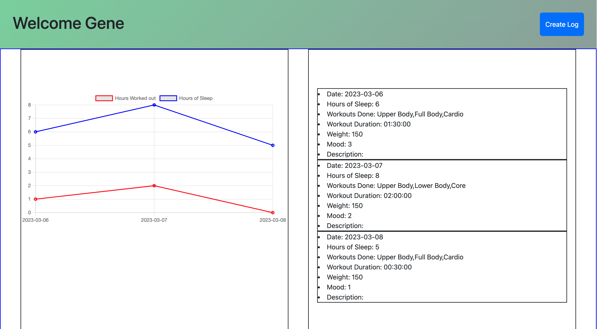

# The Wellness Tracker
## Table of contents

- [Overview](#overview)
  - [Description](#description)
  - [Screenshot](#screenshot)
  - [The Process](#the-process) 
  - [Built with](#built-with)
  - [Before you start](#before-you-start)
  - [What we Learned](#what-we-learned)

## Overview

### Description
In project #2 we were given the opportunity to showcase what we've learned over the past six modules to create a real-world full-stack application. To demonstrate our skills and ability to work as a team, we created a Wellness Tracker. This application will track users' worksouts, duration of workouts, weight, mood. In addition, it will display a graph to track users' progress. 

### Usage

On the homepage the user will have the option to log in if they already have an account or sign up to create a new account.

Upon clicking the 'sign-up' option, the user will be taken to a page were they will need to submit the necessary information to create a new account.

Once the account is created the user will be able to log in with the account they created.

After logging in they will be taken to their profile where they can keep track of their past logs and progress with the chart displayed.

To create a new log the user will click the 'create log' option where they will be taken to the following page. They will need to answer the following prompts and hit save to.

### Links

- GitHub Repo: [https://github.com/kenghoufong1/WellnessTracker]
- Deployed Link: [XX]

### Built with
- Node.js, Express.js, MySQL, Sequelize, HTML, CSS, Bootstrap,JS, chartjs, handlebars

## Before you start
- Make sure to run 'npm i' in the terminal to install the dependencies. 

### What we Learned
- We learned paying attention to details is crucial when building, as we had some inconsistencies in our naming or how we organized our files that created bugs. Staying focused on the key requirements helped us focus on the right things and help manage our time to finish on time. Clear communication to align quickly to build the framework of our app was key to making quick decisions. When learning a new technology and implementing, we learned that it's best to build in small pieces, test frequently, and build upon those pieces to help debug issues easier and faster. 